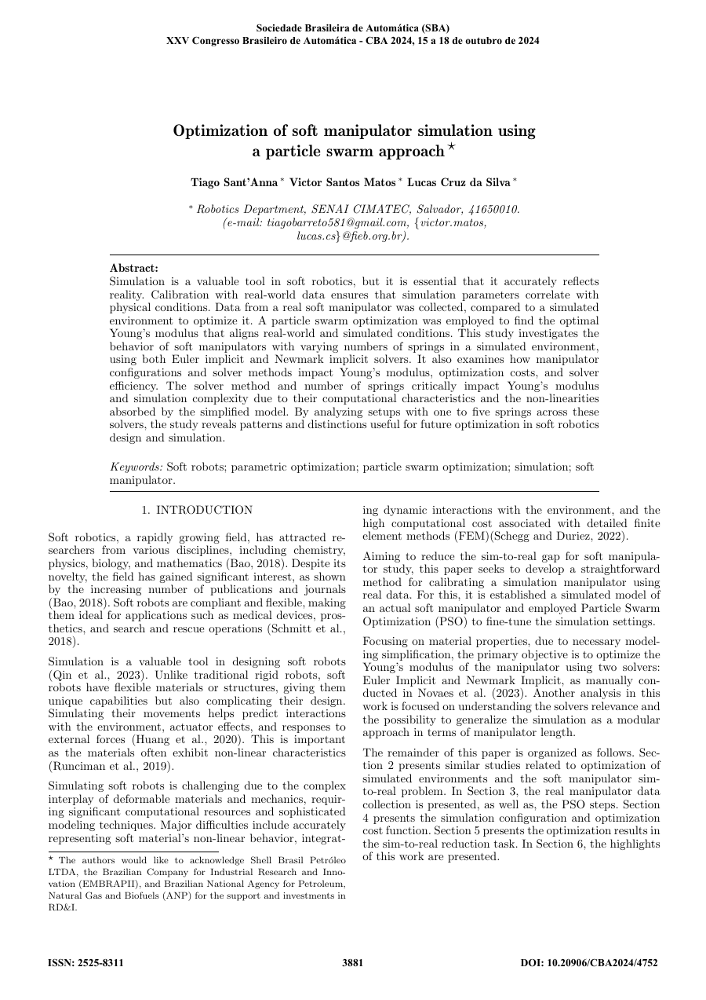
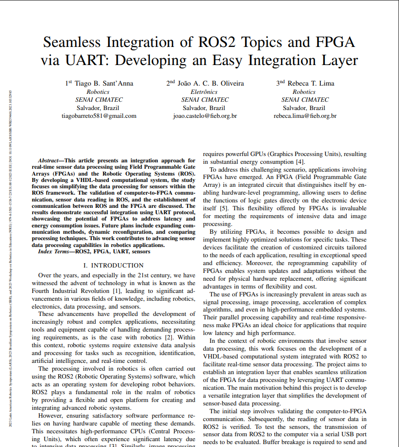
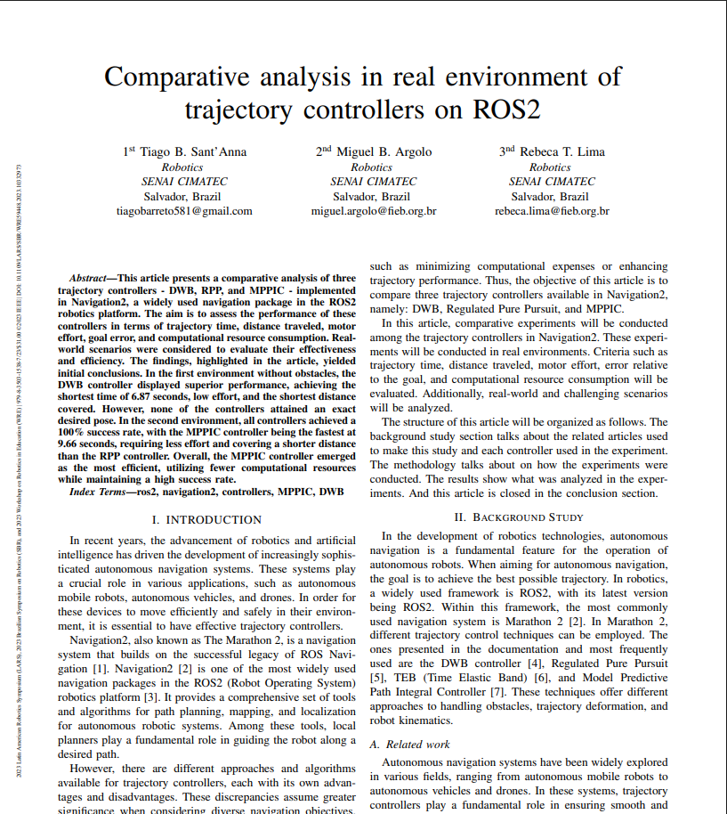

# Papers

Publications from my research work, mostly around soft robotics and ROS 2 tooling.

  
  

    <h4>Optimization of soft manipulator simulation using a particle swarm approach</h4>
    
T. Sant'Anna, V. S. Matos, L. C. da Silva — XXV Congresso Brasileiro de Automática (CBA), 2024

    
<a href="https://doi.org/10.20906/CBA2024/4752">Read paper →</a>

  

  
  

    <h4>Seamless Integration of ROS2 Topics and FPGA via UART: Developing an Easy Integration Layer</h4>
    
T. B. Sant'Anna, J. A. C. B. Oliveira, R. T. Lima — LARS-SBR-WRE, IEEE, 2023

    
<a href="https://ieeexplore.ieee.org/document/10332985/">Read paper →</a>

  

  
  

    <h4>Comparative analysis in real environment of trajectory controllers on ROS2</h4>
    
T. B. Sant'Anna, M. B. Argolo, R. T. Lima — LARS-SBR-WRE, IEEE, 2023, pp. 308–312

    
<a href="https://ieeexplore.ieee.org/document/10332973/">Read paper →</a>

  

  

    <svg viewBox="0 0 24 24" fill="none" stroke="currentColor" stroke-width="1.5"><path d="M6 2h9l5 5v15H6z"/><path d="M15 2v5h5"/><path d="M9 13h6M9 17h6M9 9h2"/></svg>
  

  

    <h4>Recurrent neural networks for modeling soft manipulator in simulated and real environments</h4>
    
SoftRobots project, SENAI CIMATEC

    
Link pending

  

  

    <svg viewBox="0 0 24 24" fill="none" stroke="currentColor" stroke-width="1.5"><path d="M6 2h9l5 5v15H6z"/><path d="M15 2v5h5"/><path d="M9 13h6M9 17h6M9 9h2"/></svg>
  

  

    <h4>Ethics Applied to Development in Robotics</h4>
    
SENAI CIMATEC

    
Link pending

  

Full list also kept up to date on [LinkedIn](https://www.linkedin.com/in/tiago-sant-anna-860930225/).
