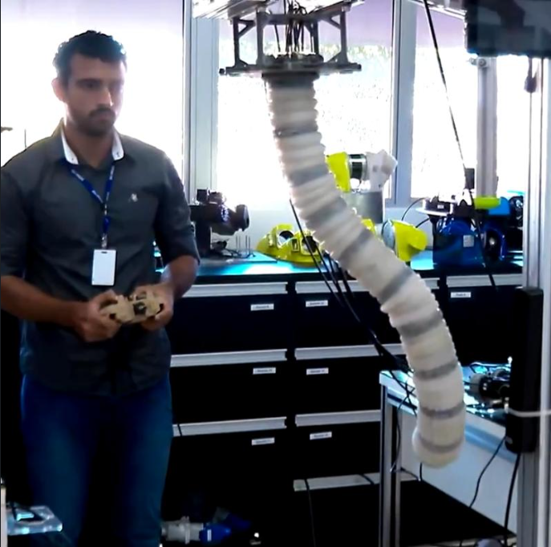
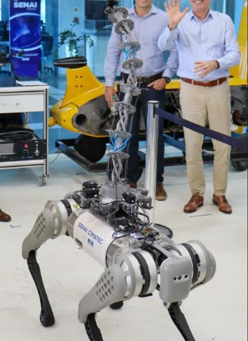
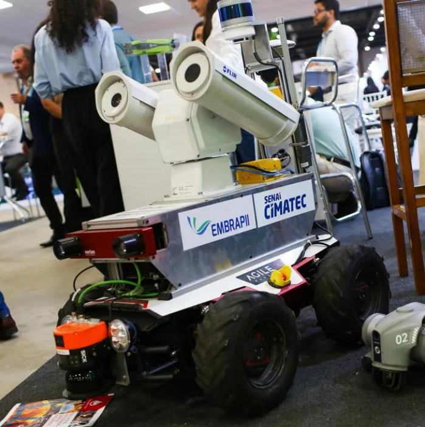
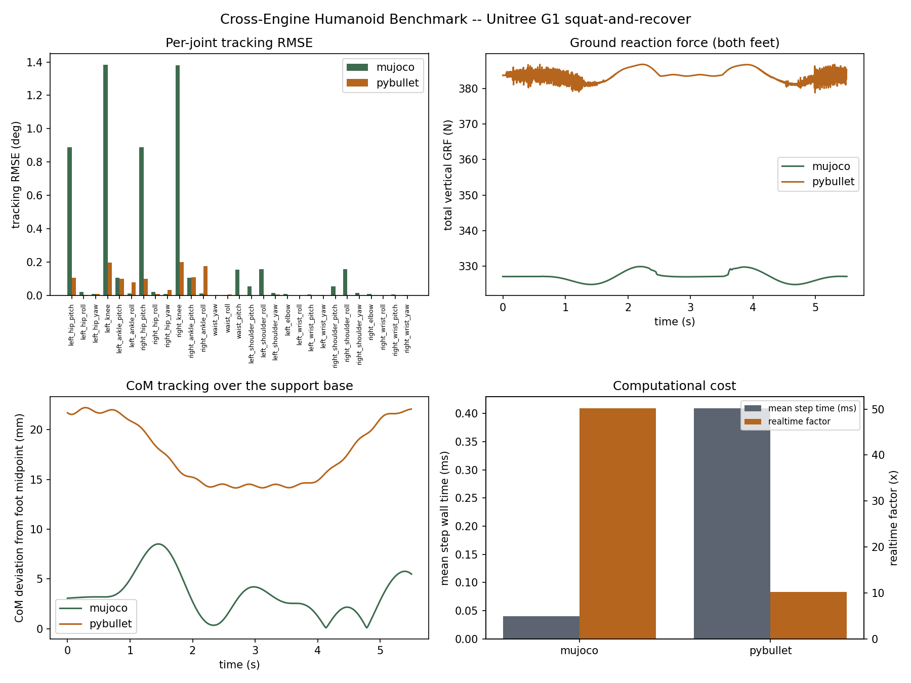

# Projects
This page contains all the projects that I have made in recent years.

# Robotics & Autonomous Systems Competence Center

  <a class="project-card" href="https://tiago369.github.io/2022-01-07-dobot/">
    
    

      <h4>Dobot Magician</h4>
      
Pick-and-place with the Dobot Magician manipulator over ROS.

    

  </a>
  

    
    

      <h4>TurtleBot</h4>
      
Mobile base used for navigation and autonomy work in the lab.

    

  

  

    
    

      <h4>ROS</h4>
      
Core middleware behind most of the lab's robotics stack.

    

  

# SoftRobots & SUBOT — SENAI CIMATEC

  

    
    

      <h4>SoftRobots — Teleoperated Prototype</h4>
      
Tendon-driven soft manipulator, teleoperated by hand controller.

    

  

  <a class="project-card" href="https://www.instagram.com/p/C217ewRAuA4/">
    
    

      <h4>SoftRobots — Quadruped Manipulator</h4>
      
Continuum manipulator mounted on a quadruped mobile base.

    

  </a>
  <a class="project-card" href="https://atarde.com.br/bahia/boge-2025-senai-investe-em-formacao-e-tecnologia-para-petroleo-e-gas-1329284">
    
    

      <h4>SUBOT Robot</h4>
      
Autonomous localization and navigation prototype for oil & gas inspection, with EMBRAPII and SENAI CIMATEC.

    

  </a>

# Open Source

A few things from my [GitHub](https://github.com/tiago369):

  <a class="project-card" href="https://github.com/tiago369/cross-engine-humanoid-benchmark">
    
    

      <h4>Cross-Engine Humanoid Benchmark</h4>
      
Benchmarks a 29-DoF Unitree G1 across MuJoCo and PyBullet, then closes the sim-to-sim gap with PSO-based calibration. CI, statistical trials, full reproducibility.

    

  </a>
  <a class="project-card" href="https://github.com/tiago369/bonzi-buddy">
    
    

      <h4>Desktop Monkey Assistant</h4>
      
A Bonzi-Buddy-style desktop assistant answering typed or spoken questions through a fully local LLM (Ollama) — no cloud APIs.

    

  </a>
  <a class="project-card" href="https://tiago369.github.io/2026-08-23-ros2-tooling/">
    
    

      <h4>ROS 2 Tooling</h4>
      
ros2-serial-fpga (UART ↔ FPGA bridge in VHDL), dobot-mgc-ros2-pkg, and fastdds_config_files.

    

  </a>

# IEEE

  <a class="project-card" href="https://ieeecimatec.github.io/project-mao_espelhada/">
    
    

      <h4>Mirrored Hand</h4>
      
Computer-vision-driven mirrored robotic hand to assist people with physical disabilities.

    

  </a>
  <a class="project-card" href="https://ieeecimatec.github.io/rasweekend/">
    
    

      <h4>IEEE RAS Weekend</h4>
      
IEEE RAS CIMATEC student branch event.

    

  </a>

